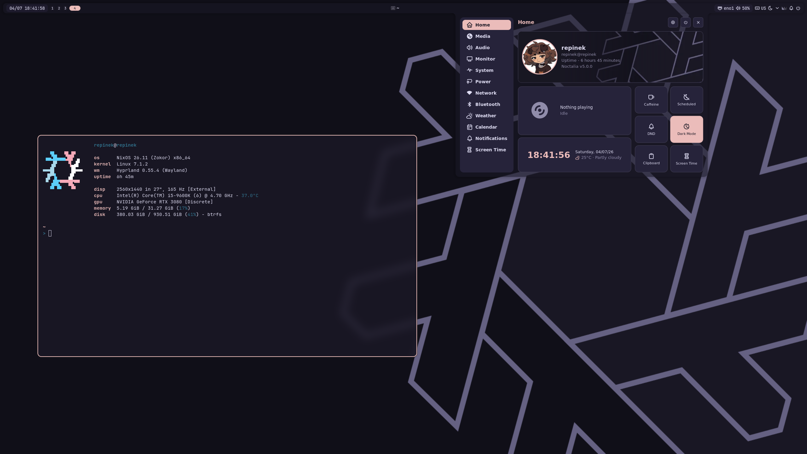
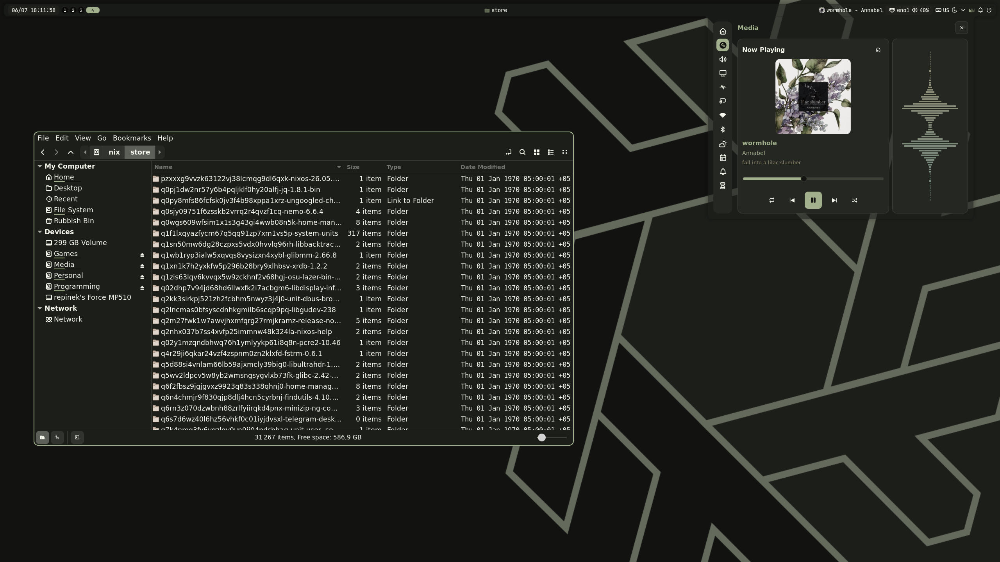

# repinek's NixOS dotfiles
Declarative [NixOS](https://nixos.org) config for personal use. 

## Screenshots




## Features and Main Packages
- Flake-based with fully modular system
- Supports multiple hosts and users
- Fully configured desktop experience with Hyprland and Noctalia Shell
- Theme management with Noctalia Shell: handles wallpapers, GTK, Qt5/6, btop, Alacritty, fastfetch, Hyprland, VSCodium 
- A lot of useful [aliases](modules/shell/fish/fish-aliases.nix)
- Ergonomic [keybindings](modules/desktop/hypr/hyprland/keybinds.nix) for Hyprland

### Programs
- **WM**: [Hyprland](https://github.com/hyprwm/Hyprland)  
- **Desktop Shell**: [Noctalia Shell](https://github.com/noctalia-dev/noctalia)  
- **File Manager**: [Nemo with extensions](https://github.com/linuxmint/nemo)
- **Terminal**: [Alacritty](https://github.com/alacritty/alacritty)  
- **Shell**: [fish](https://github.com/fish-shell/fish-shell)
- **Browsers**:
    - [Waterfox](https://github.com/BrowserWorks/Waterfox) _(3-rd party flake)_
    - [ungoogled-chromium](https://github.com/ungoogled-software/ungoogled-chromium)
- **Messengers**:  
    - [Telegram desktop](https://github.com/telegramdesktop/tdesktop)  
    - [Vesktop](https://github.com/Vencord/Vesktop)
    - [Element](https://github.com/element-hq/element-web)
- **Development & Reverse Engineering**:  
    - [JADX](https://github.com/skylot/jadx)
    - [VSCodium](https://github.com/VSCodium/vscodium)  
    - [Rider](https://www.jetbrains.com/rider/)* (not configured yet)  
    - [Vim](https://github.com/vim/vim) (not configured yet)  
    - [opencode CLI](https://github.com/anomalyco/opencode/)
    - _TODO: IDA Pro_
    - _TODO: Neovim (nvf or nixvim idk)_
- **Games**: 
    - [osu!lazer](https://github.com/ppy/osu)** _(w/ [gammastep](https://gitlab.com/chinstrap/gammastep))_
    - [Steam](https://store.steampowered.com/about/)*
    - _TODO: gamemoded_
- **Other Utilities with GUI**:
    - [OBS Studio](https://github.com/obsproject/obs-studio)
    - [Local Send](https://github.com/localsend/localsend)
- **VPN Client**: [Throne](https://github.com/throneproj/Throne) _(powered by [sing-box](https://github.com/SagerNet/sing-box))_
- **Other CLI Utilities**:
    - btrfs related, gh, git, ssh, fastfetch, starship, scrcpy, platform-tools* (adb and fastboot) and many others...
    see all [here](modules/core/packages/) and [here](modules/cli/)

\* - propietary software  
\** - open source but has propietary pieces (e.g. anticheat in osu!lazer)

## Usage
> [!WARNING]  
> This is my personal configuration, created only for me, for my personal hardware and workflow.  
> **DO NOT COPY & PASTE IT BLINDLY**  
> Use it only as a **reference** to build and configure your own config.  

If you know what you are doing and just want to look around:
```bash
git clone https://github.com/repinek/nixos-dotfiles.git
cd nixos-dotfiles
```

## TODO
- [ ] Configure MIME types
- [ ] Configure Media viewer (video, photos, audio, etc.)

Also, there's a lot of `FIXME` comments 

## License
This project is licensed under the **MIT License**.  
See the [LICENSE](LICENSE) file for details.

## Credits
[datsfilipe dotfiles](https://github.com/datsfilipe/dotfiles) - Highly inspired  
[Ruject nixos-infra](https://git.ruject.fun/RuJect/nixos-infra)
