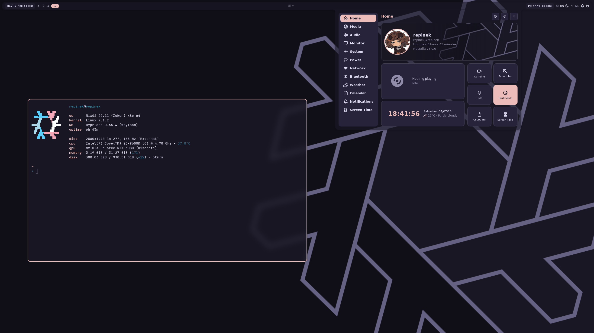
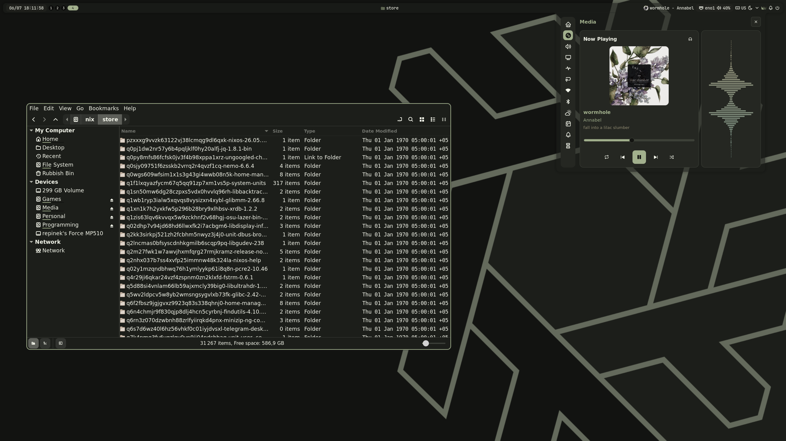

# repinek's NixOS dotfiles
Declarative [NixOS](https://nixos.org) configuration with Home Manager for personal use.

##### Contents
- [Screenshots](#screenshots)
- [Features](#features-and-main-packages)
    - [Programs](#programs)
- [Usage](#usage)
- [TODO](#todo)
- [License](#license)
- [Credits](#credits)

## Screenshots




## Features and Main Packages
- Flake-based with fully modular system
- Supports multiple hosts and users
- Fully configured desktop experience with Hyprland and Noctalia Shell
- Theme management with Noctalia Shell for wallpapers, GTK, Qt5/6, btop, Alacritty, Fastfetch, Hyprland, and VSCodium
- Useful [aliases](modules/shell/fish/fish-aliases.nix)
- Ergonomic [keybindings](modules/desktop/hypr/hyprland/keybinds.nix) for Hyprland
- Own [packages](pkgs/)
- Daily incremental [Btrfs backups](modules/core/btrfs/system.nix) with seven-day retention and monthly integrity scrubs

### Programs
- **WM**: [Hyprland](https://github.com/hyprwm/Hyprland)  
- **Desktop Shell**: [Noctalia Shell](https://github.com/noctalia-dev/noctalia)  
- **File Manager**: [Nemo with extensions](https://github.com/linuxmint/nemo)
- **Terminal**: [Alacritty](https://github.com/alacritty/alacritty)  
- **Shell**: [fish](https://github.com/fish-shell/fish-shell)
- **Browsers**:
    - [Waterfox](https://github.com/BrowserWorks/Waterfox) _(third-party flake)_
    - [ungoogled-chromium](https://github.com/ungoogled-software/ungoogled-chromium)
- **Messengers**:  
    - [Telegram Desktop](https://github.com/telegramdesktop/tdesktop)
    - [Vesktop](https://github.com/Vencord/Vesktop)
    - [Element](https://github.com/element-hq/element-web)
- **Development**:  
    - [VSCodium](https://github.com/VSCodium/vscodium)  
    - [Rider](https://www.jetbrains.com/rider/)* _(not configured yet)_
    - [Vim](https://github.com/vim/vim)
    - [Zed](https://github.com/zed-industries/zed) _(not configured yet)_
    - [Codex](https://github.com/openai/codex)
    - [OpenCode](https://github.com/anomalyco/opencode/)
    - _TODO: Neovim (nvf or nixvim idk)_
- **Reverse Engineering**:
    - [IDA Pro](https://hex-rays.com/ida-pro)* with [ida-pro-mcp](https://github.com/mrexodia/ida-pro-mcp)
    - [JADX](https://github.com/skylot/jadx)
    - [Detect It Easy](https://github.com/horsicq/Detect-It-Easy)
    - _TODO: ilspycmd, reqable* or proxypin_
- **Games**: 
    - [osu!lazer](https://github.com/ppy/osu)** _(w/ [gammastep](https://gitlab.com/chinstrap/gammastep))_
    - [Steam](https://store.steampowered.com/about/)*
    - [Touhou wrapper](https://github.com/nerusuki/thcrap-steam-proton-wrapper)
- **Other Utilities with GUI**:
    - [OBS Studio](https://github.com/obsproject/obs-studio)
    - [Local Send](https://github.com/localsend/localsend)
    - [LosslessCut](https://github.com/mifi/lossless-cut)
    - [Audacity](https://github.com/audacity/audacity)
    - [GNOME Disk Utility](https://gitlab.gnome.org/GNOME/gnome-disk-utility)
    - [Proton Authenticator](https://github.com/ProtonMail/WebClients/)
    - [Krita](https://github.com/kde/krita)
    - [Filelight](https://github.com/kde/filelight)
    - [LibreOffice](https://github/LibreOffice/core)
    - [Obsidian](https://obsidian.md)*
    - _TODO: filezilla_
- **VPN Client**: [Throne](https://github.com/throneproj/Throne) _(powered by [sing-box](https://github.com/SagerNet/sing-box))_
- **Other CLI Utilities**:
    - scrcpy, platform-tools*, steamguard-cli, Starship, Btrfs utilities, GameMode, and common tools such as Git, rsync, curl, bat, eza, ripgrep, ffmpeg, Fastfetch, GitHub CLI, and SSH.
    See [core packages](modules/core/packages/), [CLI modules](modules/cli/), and [game modules](modules/games/).

\* - `unfree` or proprietary software  
\** - open source but has proprietary pieces (e.g. anticheat in osu!lazer)

## Structure

```
nixos-dotfiles
├── assets                  # Static assets: screenshots, wallpapers, etc.
├── hosts                   # per-host configuration
│   └── desktop
│       ├── home            # Home Manager options for this host (user.nix files only)
│       ├── default.nix     # NixOS options for this host (system.nix files only)
│       └── hardware-configuration.nix
├── lib                     # Nix build helpers
│   └── mkNixos.nix
├── modules                 # Reusable system and user modules
│   ├── cli
│   ├── core
│   │   ├── boot
│   │   ├── btrfs
│   │   ├── fonts
│   │   ├── nix
│   │   ├── packages        # Base system packages
│   │   ├── security
│   │   └── system
│   ├── desktop
│   │   ├── hypr            # hypr ecosystem
│   │   │   └── hyprland
│   │   ├── ly
│   │   ├── noctalia
│   │   └── theme
│   ├── editors
│   ├── games
│   ├── hardware
│   │   ├── audio
│   │   └── nvidia
│   ├── programs
│   ├── services
│   └── shell
│       └── fish
├── pkgs                    # Custom packages (Standalone flake)
│   ├── google-sans
│   ├── ida-pro
│   ├── ida-pro-mcp
│   ├── flake.nix
│   └── README.md
├── users                   # per-user configuration
│   └── repinek
│       ├── home.nix        # Home Manager options for this user (user.nix files only)
│       └── system.nix      # NixOS options for this user
└── flake.nix
```

## Usage
> [!WARNING]  
> This is my personal configuration, created only for me, for my personal hardware and workflow.  
> **DO NOT COPY & PASTE IT BLINDLY**  
> Use it only as a **reference** to build and configure your own config.  

If you know what you are doing and just want to look around:
```bash
git clone https://github.com/repinek/nixos-dotfiles.git
cd nixos-dotfiles
```

## TODO
- [ ] refactor core folder a little
- [ ] Try niri one day
- [ ] Configure MIME types
- [ ] Configure Media viewer (video, photos, audio, etc.)

There are also several `FIXME` comments.

## License
This project is licensed under the **MIT License**.  
See the [LICENSE](LICENSE) file for details.

## Credits
- [datsfilipe dotfiles](https://github.com/datsfilipe/dotfiles) - Architecture is heavily inspired by these dotfiles
- [Ruject nixos-infra](https://git.ruject.fun/RuJect/nixos-infra) - Some modules and architectural ideas were adapted from this project
